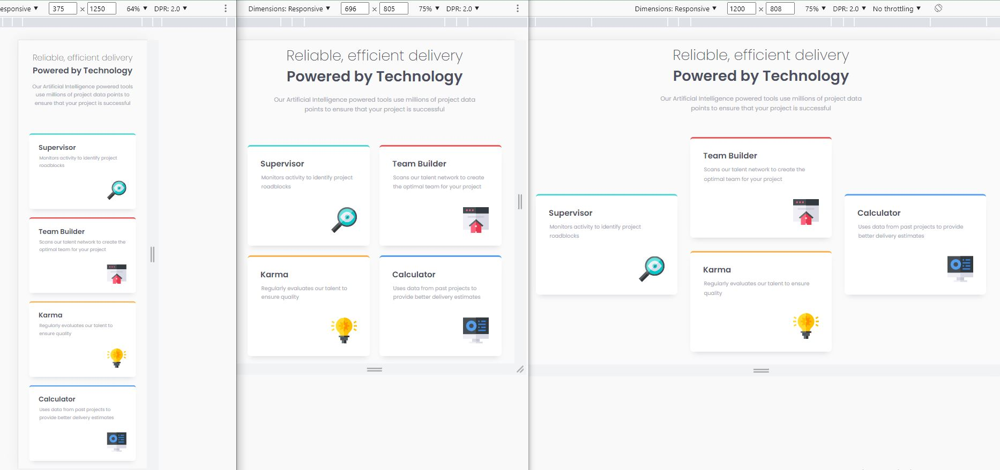

# Frontend Mentor - Four card feature section solution

This is a solution to the [Four card feature section challenge on Frontend Mentor](https://www.frontendmentor.io/challenges/four-card-feature-section-weK1eFYK).

## Table of contents

- [Overview](#overview)
  - [The challenge](#the-challenge)
  - [Screenshot](#screenshot)
  - [Links](#links)
- [My process](#my-process)
  - [Workflow](#workflow)
  - [Built with](#built-with)
  - [What I learned](#what-i-learned)
  - [Continued development](#continued-development)
  - [Useful resources](#useful-resources)
- [Author](#author)
- [Acknowledgments](#acknowledgments)

## Overview

### The challenge

Users should be able to:

- View the optimal layout for the site depending on their device's screen size

### Screenshot

### Links

- Solution: [frontendmentor.io](https://www.frontendmentor.io/solutions/four-card-feature-section-u45_a8yTW_)

- Live Site: [github.io](https://siavhnz.github.io/frontendmentor/11.four-card-feature/index.html)

## My process

### Workflow
- Setting up the workflow (Initialize git, setting up folders structure)
- setting up the CSS Preflight (adding CSS normalize, google font)
- Creating HTML skeleton based on `./assets/design`
- Working on mobile design (375 x 1360 px)
- Working on Desktop design (1440 x 992 px)
- Working on tablet breakpoints
- Writting README.md
- publish on github.io | github.com | frontendmentor.io

### Built with

- Semantic HTML5 markup
- CSS custom properties
- Mobile-first workflow
- Flexbox
- CSS Grid

### What I learned

I read about [CSS Cube](https://cube.fyi/) and [BEM](http://getbem.com/) methodology then tried to
make my CSS styles semantic to others.

### Continued development

### Useful resources
- [CSS Cube](https://cube.fyi/)

- [BEM](http://getbem.com/)

## Author

- Frontend Mentor - [@siavhnz](https://www.frontendmentor.io/profile/siavhnz)

## Acknowledgments

Thanks To

[Frontendmentor.io](https://www.frontendmentor.io/challenges) - for their Excitement challenges  

[Perfect Pixel](https://chrome.google.com/webstore/detail/perfectpixel-by-welldonec/dkaagdgjmgdmbnecmcefdhjekcoceebi?hl=en) - for such a great extension
